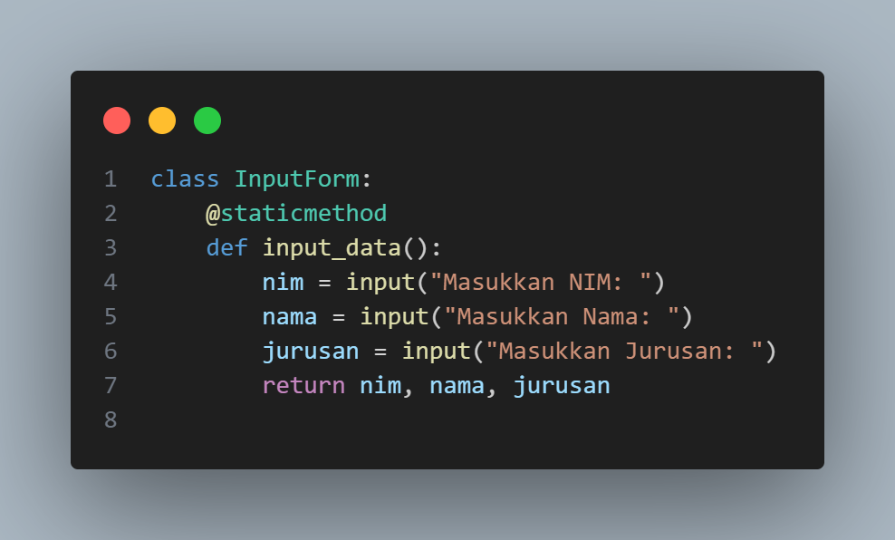
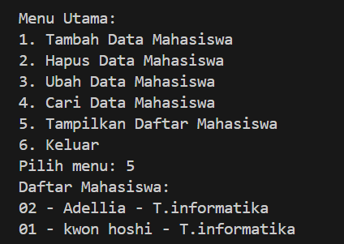

# TUGAS PRAKTIKUM 8
# Data Diri

Nama : ADELLIA REZQI SALMABILLAH

NIM : 312410395

Kelas : TI.24.A.3

# input dan output dari Program1

## 1. Input Data/Mahasiswa.py

## 2. Input View/Input_Form.py

## 3. Input View/Mahasiswa.py

## 4. Input Main.py

## Output Tambah Data 

## Output Tampilkan Semua Mahasiswa

## Output Ubah Data

## Output Cari Data Mahasiswa

## Output Hasil Akhir

Program terdiri dari 4 komponen utama:

1. data/mahasiswa.py:
Class Mahasiswa: Model data mahasiswa (NIM, nama, jurusan, angkatan).
Class DataMahasiswa: Mengelola data mahasiswa dengan fungsi CRUD (tambah, hapus, ubah, cari, tampilkan semua).

2. view/input_form.py:
Class InputForm: Mengumpulkan input data dari pengguna (NIM, nama, jurusan, angkatan).

3. view/mahasiswa.py:
Class ViewMahasiswa: Menampilkan data mahasiswa:
tampilkan_list: Menampilkan semua mahasiswa.
tampilkan_detail: Menampilkan detail mahasiswa tertentu.

4. main.py:
Program utama yang menyediakan menu interaktif:
Tambah, hapus, ubah, cari, atau tampilkan data mahasiswa.
Mengintegrasikan semua komponen dari data dan view.